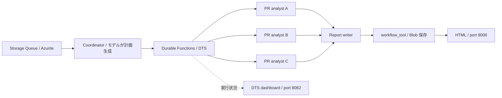

# Dynamic Workflows / Workflow Subagents — Codespaces デモ

公式の [workflow-subagents-preview](https://github.com/Azure/azure-functions-agents-runtime/tree/3ab9e8d9b9749c2a4ad15f65703a13255fbecb2b/samples/workflow-subagents-preview) を、GitHub Codespaces で実行するための独立したサンプルです。ランタイムも同じコミットに固定しています。

Queue の依頼から、モデルが動的に実行計画を作り、3 件の PR を別々のサブエージェントで並列分析します。分析結果を別のエージェントが日本語 HTML にまとめ、Blob に保存します。DTS ダッシュボードで実行を観察できます。

**PR の状態と履歴は模擬データ、ワークフローとモデル呼び出しは実処理です。** GitHub API への接続や PR の変更は行いません。Hosted Skills / Dynamic Workflows は Preview です。



## 1. GitHub に配置して Codespace を開く

このフォルダーの内容をリポジトリのルートに置きます。`.devcontainer` などの隠しフォルダーも必要です。ローカルの GitHub CLI で新しい非公開リポジトリに置く場合は、このフォルダーで次を実行します。

```bash
gh auth login
git init -b main
git add .
git commit -m "Add workflow subagents Codespaces demo"
gh repo create workflow-subagents-codespaces-demo --private --source=. --push
gh repo view --web
```

GitHub の **Code → Codespaces → Create codespace on main** を選びます。4 cores / 8 GB 以上を指定してください。初回セットアップで Python 3.13、Functions Core Tools v4、Azure CLI、Docker、Python 依存パッケージを用意します。初期化が終わるまで待ちます。

Codespaces は利用枠に応じて課金されます。Azure 上の Functions、Storage、DTS リソースの新規作成は不要です。モデル推論には既存の Azure 接続先を利用し、推論料金が発生します。

## 2. モデルを設定する

公式サンプルと同じ **Microsoft Foundry** が初期設定です。必要なものは、既存の Foundry プロジェクトエンドポイント、そのプロジェクトで利用できるモデルデプロイ名、推論を実行できるアカウントです。

```bash
./demo configure
az login --use-device-code
./demo doctor
```

`configure` の 2 つの入力欄に、実際の値を入力します。

| 入力 | 指定する値 |
| --- | --- |
| `FOUNDRY_PROJECT_ENDPOINT` | Foundry に表示される `/api/projects/<project>` を含む HTTPS エンドポイント |
| `FOUNDRY_MODEL` | 使用する既存モデルのデプロイ名。モデル名とデプロイ名が異なる場合はデプロイ名 |

モデルにはツール呼び出しを扱えるものを利用してください。特定のモデルがデプロイ済みとは仮定していません。権限やネットワーク制限がある場合は、その環境の管理者による設定が必要です。

Azure OpenAI を利用する場合は、代わりに次を実行します。

```bash
./demo configure --provider azure_openai
az login --use-device-code
```

API キー方式を使う場合のみ、GitHub の **Settings → Codespaces → Secrets** で `AZURE_OPENAI_API_KEY` を登録してこのリポジトリへのアクセスを許可し、Codespace を再起動します。キーをチャット、リポジトリ、シェルコマンドへ貼り付ける必要はありません。

`AZURE_FUNCTIONS_AGENTS_PROVIDER` と各プロバイダーのエンドポイント・モデルの値も Codespaces Secrets から渡せます。環境変数はローカル設定より優先します。設定ファイル `src/local.settings.json` は Git 管理対象外で、設定コマンドは API キーを保存しません。`doctor` は前提条件の確認であり、モデルへの接続・権限の成功を保証するものではありません。

## 3. デモを実行する

ターミナル A:

```bash
./demo start
```

Azurite と DTS が起動し、Functions ホストとレポート表示サーバーが起動します。Functions の起動完了と Queue トリガーの登録を確認してください。このターミナルは開いたままにします。

ターミナル B:

```bash
./demo submit --wait
```

Codespaces の **PORTS** タブから次を開きます。ポートの公開範囲は **Private** に保ってください。

| ポート | 見るもの |
| --- | --- |
| 8082 | DTS ダッシュボード。Task Hub `prstatusreports` を選択し、インスタンス・各タスクの状態を確認 |
| 8000 | 生成後に `/report.html` を開く。最初の `/` は実行案内 |

このサンプルの入口は Queue です。チャット画面は追加していません。7071 は Functions ホスト、8080 は DTS の内部接続、10000–10002 は Azurite の内部接続です。

`requests/demo.json` は、マージ可能・変更要求と CI 失敗・Draft と CI 待機の 3 ケースになる URL を選んでいます。URL は模擬データの選択キーであり、リンク先 PR の実際の状態を表していません。

`submit --wait` は最大 600 秒待ちます。HTML の形式と全 PR URL を検証してから表示用ファイルを保存します。実行中は DTS を観察してください。モデルの生成時間によってはデモ前に一度ウォームアップすると説明しやすくなります。

## 4. 同じ保存先を更新する

最初の実行完了後、もう一度同じコマンドを実行します。

```bash
./demo submit --wait
```

Blob の保存先は `workflow-reports/reports/functions-pr-status.html` のままです。既存 Blob の ETag を取得してから投入し、ETag が変わるまで成功扱いしません。PORTS の 8000 を再読み込みして新しい HTML を見ます。直近の確認結果は `.demo/last-request.json` に残ります。同じ保存先へのデモは一度に 1 件ずつ実行してください。

## 5. 検証と終了

```bash
./demo test
./demo verify --timeout 600
```

`test` は外部モデルを呼びません。`verify` は公式検証スクリプトを基に、一時的な Functions アプリと専用のエミュレーターを別ポートで起動し、**実モデルを使って 2 回実行**します。全 PR リンク、Blob の ETag 更新、同じ保存先が 1 個であることを確認します。通常デモのデータを削除しません。検証用のコンテナーと一時アプリは終了時に破棄します。

ターミナル A で Ctrl+C を押して Functions とレポートサーバーを止め、次を実行します。

```bash
./demo stop
```

最後に GitHub の Codespaces 一覧から **Stop codespace** を実行します。`./demo stop` だけでは Codespace 自体は停止しません。

Azurite のデータは Docker volume に残ります。DTS エミュレーターは実行状態の永続保存先として扱わないでください。エミュレーターや Codespace の停止後に実行中ワークフローが復元されることは、この構成では保証しません。ワーカー再起動からの継続を試す場合は、DTS/Azurite を動かしたまま Functions だけを Ctrl+C で停止・再起動します。

## 困ったとき

| 症状 | 対処 |
| --- | --- |
| `.venv` がない / セットアップ失敗 | 作成ログを確認後 `./demo setup`。Codespaces の Rebuild Container でも再構築可能 |
| Docker に接続できない | コンテナーの起動を待って `docker info`。解消しなければ Rebuild Container |
| 401 / 403 | `az login --use-device-code` をやり直し、プロジェクト・モデルの利用権限を確認 |
| モデルやデプロイが見つからない | `./demo configure` で endpoint とデプロイ名を確認 |
| Task Hub がない | `compose.yaml` と `src/local.settings.json` の `prstatusreports` を確認。設定変更後は `docker compose up -d --force-recreate dts`、その後 Functions を再起動（実行中のデモ終了後に行う） |
| 待機がタイムアウト | 8082、ターミナル A、`./demo logs` を確認。Queue の失敗メッセージは `pr-status-requests-poison` に移る場合がある。先に原因を直し、元の実行が終了したことを確認して再投入 |
| ブラウザーから localhost が開けない | 手元 PC の localhost ではなく、Codespaces の PORTS タブで転送先を開く |
| 前回のレポートが見える | 今回の `submit --wait` の PASS と ETag 更新を待ってから再読み込み |

## ファイルと出典

- `.devcontainer/`: Codespaces の Python / CLI / Docker 環境
- `src/`: 公式サンプルのエージェント、スキル、ツール
- `scripts/`: 設定、起動、投入、検証
- `requests/demo.json`: 3 ケースのデモ入力
- [docs/DEMO.md](docs/DEMO.md): 進行台本
- [docs/VALIDATION.md](docs/VALIDATION.md): 実施済み・未実施の検証記録
- [docs/UPSTREAM.md](docs/UPSTREAM.md): 固定コミットと変更点
- [Microsoft Learn: Dynamic Workflows](https://learn.microsoft.com/ja-jp/azure/azure-functions/functions-hosted-skills-dynamic-workflows)
- [Microsoft Learn: 作成と実行](https://learn.microsoft.com/ja-jp/azure/azure-functions/functions-hosted-skills-dynamic-workflows-how-to)
- [GitHub Docs: Codespaces のポート転送](https://docs.github.com/en/codespaces/developing-in-a-codespace/forwarding-ports-in-your-codespace)
